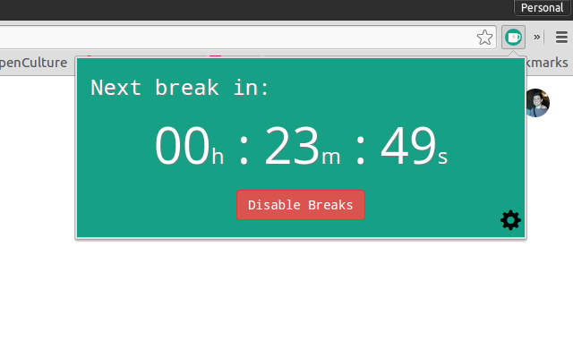
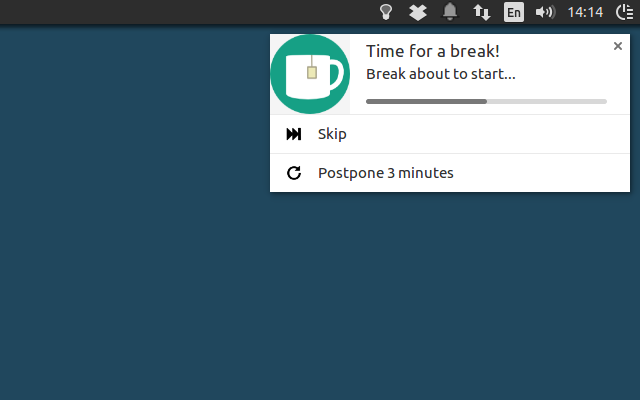
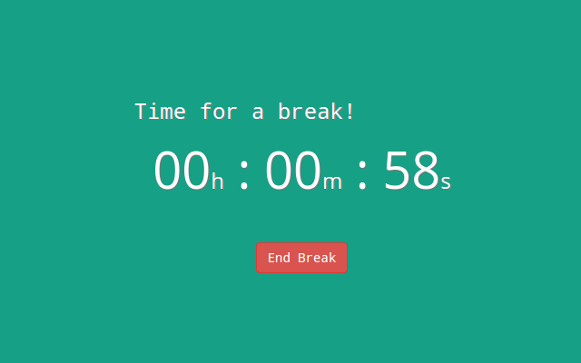

# Break Timer

[Chrome extension](https://chrome.google.com/webstore/detail/break-timer/hklkdbpicdmlpoiellngedpejjkmapei)

[Firefox addon](https://addons.mozilla.org/en-US/firefox/addon/break-timer-app/)

Break Timer allows you to set up customizable breaks and will remind you to take them. Taking breaks whilst working or studying is crucial in preventing RSI, eye-strain and tiredness.

Break Timer allows you to customize:
 * How long your breaks are and how often you wish to have them
 * Whether to be reminded with a simple notification or a fullscreen break window
 * Working hours so you are only reminded when you want to be.

Break Timer will also intelligently restart your break countdown (optionally) when it detects that you have not been using the computer.

## Screenshots

---

---

---

## Authors

**Tom Watson**

- <http://tomjwatson.com>

## License

Code copyright Tom Watson. Code released under [the MIT license](LICENSE.txt).

